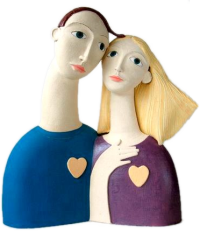

# About

My work reflects a fascination with natural and marine forms, and female figures and heads. I combine flowing lines and sweeping curves in the slab construction of my barium glazed pieces.
{: .caption}

Inspiration for my marine pieces started in my early childhood. I was born on the south coast of England and my formative years were often spent on the beach splashing in the sea, collecting shells and dipping into rock pools. I&rsquo;m still a compulsive beachcomber and hoard collections of pebbles, shells and other natural forms such as seed heads and fossils. These have inspired sculptural pieces, often to grow plants in or over, or to use as water features. My seahorses, sea serpents and fish in rich tones of blue evoke the underwater world. Delicate sea urchin forms complement these shapes in pale shades of white, mauve and turquoise.

The elegant female figures and heads were originally inspired by the geishas in Japanese prints, and the heads and figures of Modigliani, Picasso and Gustav Klimt. These have evolved into more contemporary figures and heads with a hint of attitude. Occasionally I develop an idea from studies of historical costumes, to explore shape, texture and decorative detail.

## Method

I work from thin slabs of white or buff stoneware clay bodies, which are sometimes impressed with texture from man-made or natural objects, before cutting, forming and assembling into the finished piece. My methods of cutting and assembling clay are similar to dress-making, and the use of wax resist and surface pattern are related to textile design. Decoration is also added at the completed stage either as applied textured detail or as surface pattern with slips, oxides, resists and glazes. Sometimes beaded jewellery, hat-pins and hair adornments are added after the glaze firing.

The scale of my work varies from robust garden sculptures and planters in warm rustic colours and natural surfaces, to finer, smaller pieces for interior setting, often in a range of whites, purples, blues and turquoises.

My work is fired in an electric n to between 1200℃ and 1280℃. The high-fired pieces are ideal for being displayed outdoors as well as inside.

## Finding my work

I currently have work at the following outlets:

* [St Johns Street Gallery (Ashbourne)](https://stjohngalleryandcafe.co.uk/)
  The St. John Street Gallery & Cafe is situated in the historic market town of Ashbourne in Derbyshire.

## Events

I do not have any future events scheduled at the moment. Please see the <a href="cv.html">CV page</a> for details of events past.

## Contact Sue Crossfield

I am based in Ashbourne in Derbyshire. Contact me by email on <a href="mailto:sue@suecrossfield.co.uk" title="Click here to email" class="email" style="background-image: url(images/email.gif); background-repeat:no-repeat; background-position: 11.5em -0.2em; padding-right: 2em;">sue@suecrossfield.co.uk</a>.