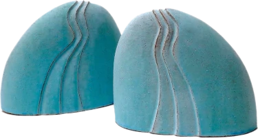

# About

My work reflects a fascination with natural and marine forms, and female figures and heads. I combine flowing lines and sweeping curves in the slab construction of my barium glazed pieces.
{: .caption}

Inspiration for my marine pieces started in my early childhood. I was born on the south coast of England and my formative years were often spent on the beach splashing in the sea, collecting shells and dipping into rock pools. I’m still a compulsive beachcomber and hoard collections of pebbles, shells and other natural forms such as seed heads and fossils. These have inspired sculptural pieces, sometimes to grow plants in or over, to use as water features, or to stand in their own right. My seahorses and fish in rich tones of blue evoke the underwater world. Delicate sea urchin forms complement these shapes in paler shades of white, mauve and turquoise.

## Method

I work in my studio at my Ashbourne home, using slabs of white or buff stoneware clay bodies, which are sometimes impressed with texture from man-made or natural objects, before cutting, forming and assembling into the finished piece. Larger pieces are sometimes carved into the surface to shape and define the form. Decoration is often added at the completed stage either as applied textured detail or as surface pattern with slips, oxides, resists and glazes before firing.

The scale of my work varies from robust sculptures in warm rustic colours and natural surfaces, to finer, smaller pieces, often in a range of whites, blues and turquoises.

My work is fired in an electric kiln to between 1200°C and 1280°C. The high-fired pieces are ideal for being displayed outdoors as well as inside.

## Events

I will be exhibiting at the following events:





## Finding my work

I currently have work at the following outlets:

* [St Johns Street Gallery (Ashbourne)](https://stjohngalleryandcafe.co.uk/)
  The St. John Street Gallery & Cafe is situated in the historic market town of Ashbourne in Derbyshire.
  


## Contact Sue Crossfield

I am based in Ashbourne in Derbyshire. You can <a href="mailto:sue@suecrossfield.co.uk" title="Click here to email" class="email">contact me by email on sue@suecrossfield.co.uk</a>.
